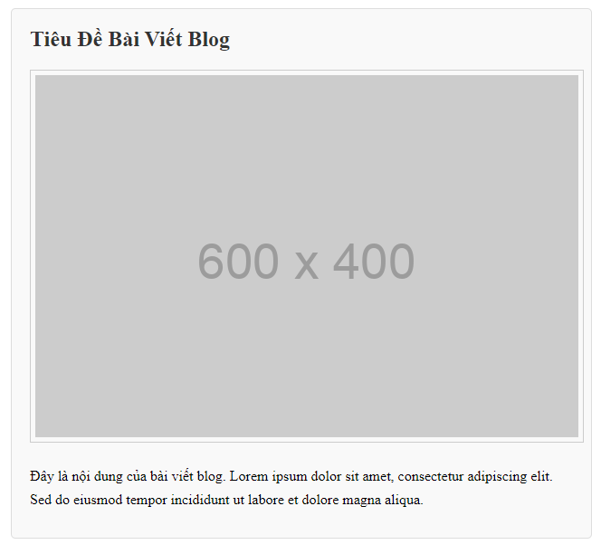
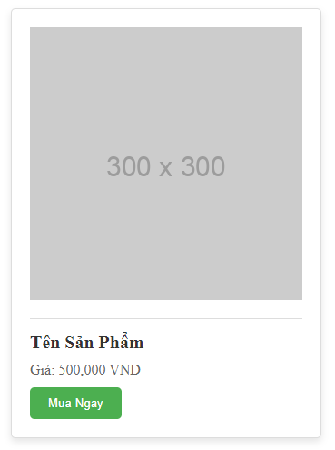
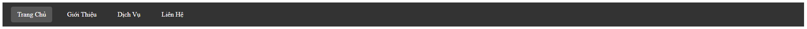

Bài tập 1: Tạo Bài Viết Blog
Yêu cầu: Tạo một bài viết blog với tiêu đề, đoạn văn, và hình ảnh. Sử dụng box model để định kiểu cho các phần tử.

Bài tập 2: Tạo Thẻ Sản Phẩm
Yêu cầu: Tạo một thẻ sản phẩm với hình ảnh, tên sản phẩm, giá, và nút mua hàng. Sử dụng box model để định kiểu cho các phần tử.

Bài tập 3: Tạo Menu Điều Hướng
Yêu cầu: Tạo một menu điều hướng với các mục menu. Sử dụng box model để định kiểu cho các mục menu.

Bài tập 4:

Bài tập 5:

