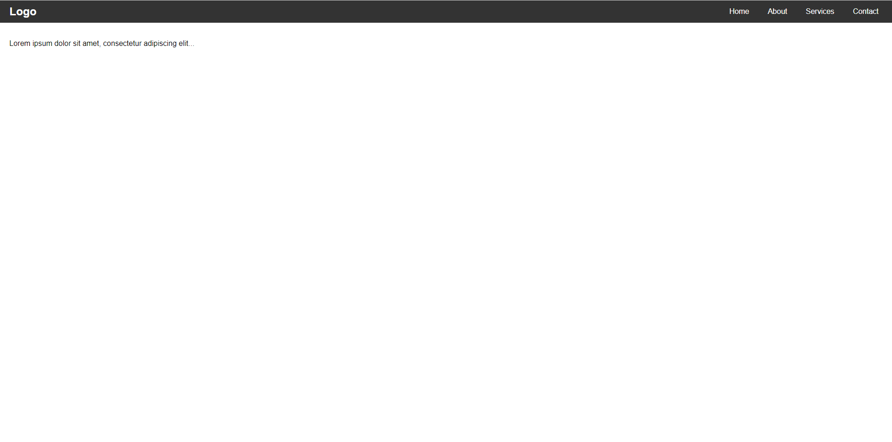
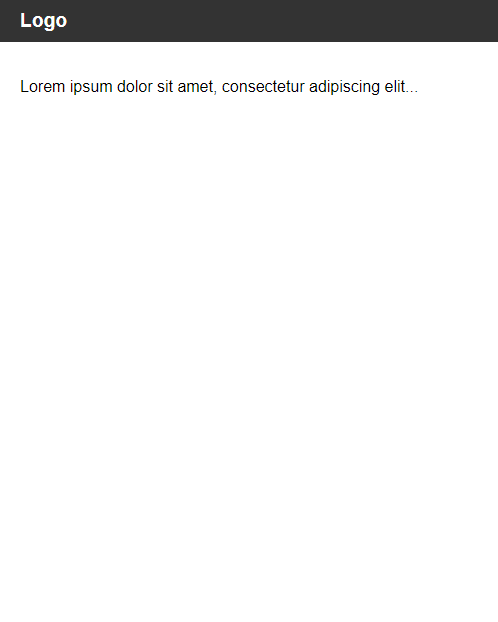
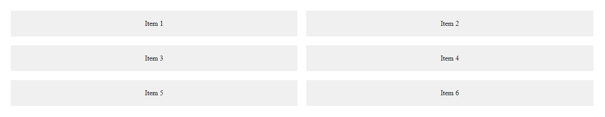
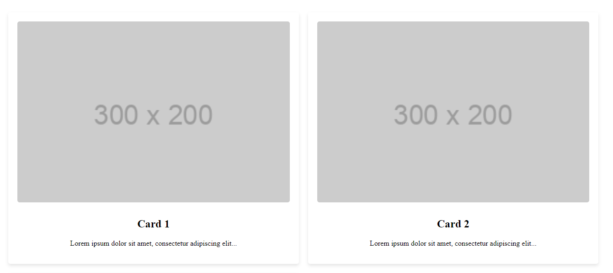
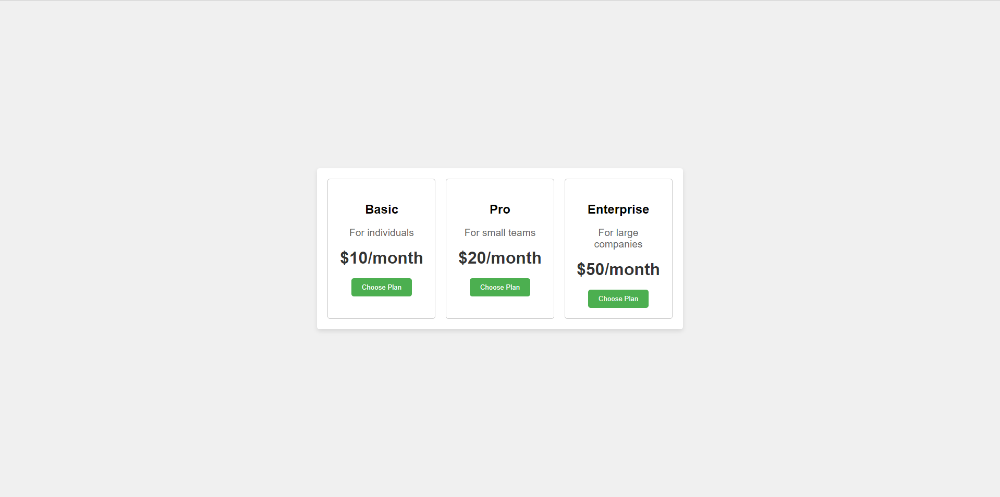
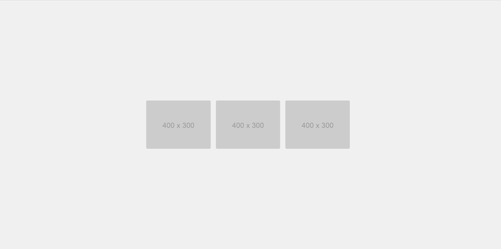
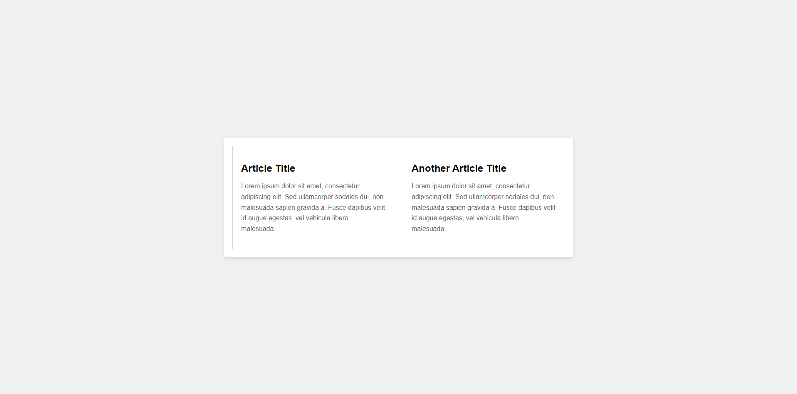

Bài tập 1: Responsive Header
Yêu cầu:

- Tạo một header đơn giản với logo và menu.
- Yêu cầu header phải thay đổi kích thước và bố cục khi màn hình thu nhỏ.
  
- Responsive
  

Bài tập 2: Responsive Flexbox Grid
Yêu cầu:

- Tạo một grid layout với các item sử dụng Flexbox.
- Đảm bảo grid layout thích ứng trên các kích thước màn hình khác nhau.
  

Bài tập 3: Responsive Flexbox Card Layout
Yêu cầu:

- Tạo một layout card sử dụng Flexbox, mỗi card chứa hình ảnh và mô tả.
- Đảm bảo card layout phải hiển thị tốt trên các kích thước màn hình khác nhau.
  

Bài tập 4: Responsive Flexbox Pricing Table
Yêu cầu:

- Tạo một bảng giá đơn giản sử dụng Flexbox.
- Bảng giá phải hiển thị tốt trên các thiết bị có màn hình khác nhau.
  

Bài tập 5: Responsive Flexbox Gallery
Yêu cầu:

- Tạo một gallery hình ảnh sử dụng Flexbox.
- Đảm bảo gallery phải hiển thị tốt trên các kích thước màn hình khác nhau.
  

Bài tập 6: Responsive Flexbox Article Layout
Yêu cầu:

- Tạo một layout article đơn giản sử dụng Flexbox.
- Đảm bảo layout phải hiển thị tốt trên các thiết bị khác nhau.
  
